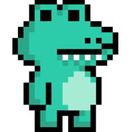
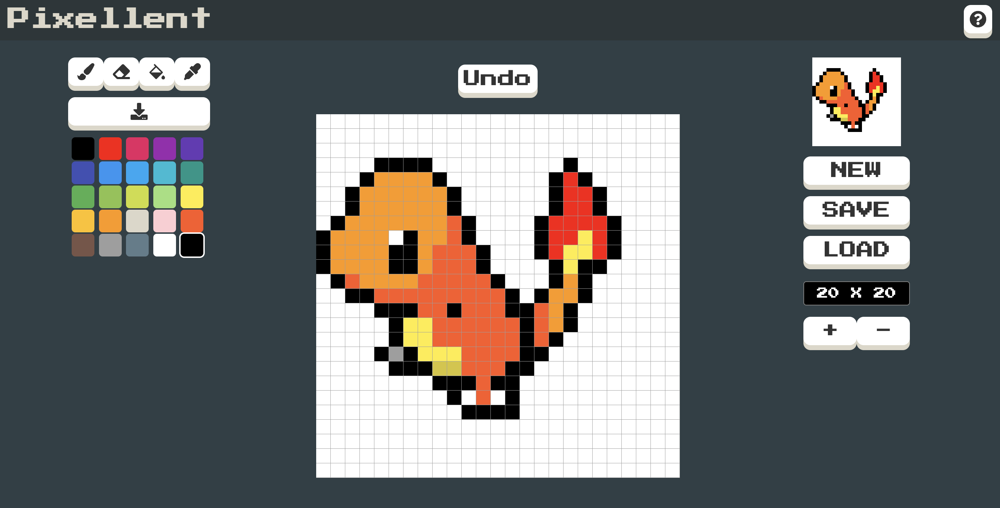

<p align="center">
   
  <h1 align="center">Pixellent</h1>
</p>
<p align="center">
  <h3 align="center">
    🎨  Make Pixel Art Easy
  </h3>
</p>

<br>

## 💁🏻‍♂️ Introduction

**Pixellent**는 픽셀 아트를 쉽게 제작할 수 있는 웹어플리케이션 입니다. <br>
자신이 만든 이미지를 png 파일로 다운받을 수 있습니다. <br>
또한, 저장과 불러오기가 가능합니다.

<p align="center">
  
</p>

<br>

## 🖇 Link

**Deploy**

- [Pixellent](https://www.pixellent.site/)

**Portfolio**

- [Frontend](https://github.com/Ravender91/Pixellent)

<br>

## ⚙️ Tech Stack

**FrontEnd**

- [React](https://facebook.github.io/react/)
- [Zustand](https://zustand-demo.pmnd.rs/)
- [Styled-Components](https://styled-components.com/)
- [React-router-dom](https://reactrouter.com/)

**Test**

- [Jest](https://jestjs.io/)
- [React Testing Library](https://testing-library.com/)

**Deploy**

- [Netilfy](https://www.netlify.com/)

<br>

## 🗝 Installation

```bash
npm install
npm start
```

<br>

## 📆 Schedule

- 2022년 6월 27일 - 2022년 7월 2일: 아이디어 선정 및 기술 검증, 계획 (칸반, 목업 작성)
  - [Idea](https://www.notion.so/Idea-f82783994eb343d0a74d3e8a8ea8d5c6)
  - [MockUp](https://www.notion.so/Mockup-8c3a4108a5a745da8a5f3e11482de2a8)
  - [KANBAN](https://www.notion.so/1d76579d574f4cd79a807cdb845d235e?v=b7e8fa10381d48f79d5a1a480402af51)
- 2022년 7월 3일 - 2022년 7월 15일: 개발 기능 구현
- 2022년 7월 16일 - 2022년 7월 22일: Stand Up 발표 준비 및 리팩토링

<br>

## 🕹 Features

<details>
<summary><span style="font-size:15px">Landing Page</span></summary>
<div markdown="1">


- START 버튼을 누르면 editor 페이지로 이동합니다.
</div>
</details>

<details>
<summary><span style="font-size:15px">Tools</span></summary>
<div markdown="1">


- Brush: react color 라이브러리 사용, 해당 버튼 누르면 색을 고를 수 있는 창이 등장. Drag 가능 (단축키: Q)
- Eraser: 작업물 지우기, Drag 가능 (단축키: W)
- Bucket: 채우기 기능 (단축키: E)
- Eyedropper: 색 추출 기능 (단축키: R)
- DownloadImage: png 파일로 저장할 수 있습니다.
- Palette: 색 고를 수 있는 기능 (선택한 색은 따로 나타내 줍니다.)

</div>
</details>

<details>
<summary><span style="font-size:15px">Canvas</span></summary>
<div markdown="1">


- 위의 기능들을 사용하여 픽셀아트를 그릴 수 있습니다.
- Undo는 이전의 작업을 되돌릴 수 있습니다. (단축키: CTRL + Z)
</div>
</details>

<details>
<summary><span style="font-size:15px">Preview</span></summary>
<div markdown="1">


- 현재 작업 중인 그림을 실시간으로 볼 수 있습니다.
</div>
</details>

<details>
<summary><span style="font-size:15px">Dimension</span></summary>
<div markdown="1">


- 캔버스의 크기를 조절할 수 있습니다.
</div>
</details>

<details>
<summary><span style="font-size:15px">Local Storage</span></summary>
<div markdown="1">


- new 버튼을 누르면 캔버스가 초기화됩니다.
- save 버튼을 누르면 Local Storage에 저장됩니다.
- load 버튼을 누르면 Local Storage에 저장된 작업물들을 보여줍니다. 클릭하면 해당 작업을 이어나갈 수 있습니다. 삭제도 가능합니다.
</div>
</details>

<br>

## 🏁 Log & Challenge

### **🔍 하나부터 열까지 스스로**

- 그림판과 같이 좌표를 통해 그림을 그리는 에디터와는 달리, Pixel 작업을 진행할 수 있는 Canvas부터 그리기 도구 기능까지 직접 구현해야 했습니다. 개발 기간이 일주일 정도 남았을 때, 설계해둔 Canvas를 갈아엎어야 하는 상황이 발생했었습니다. 채우기 기능 구현을 위해서 기존에 작업해둔 Canvas 구조로는 불가능하였기 때문입니다. <br> 누구도 도와주지 않고, 모든 걸 저 혼자 판단해서 결정하여야 하는 제한된 상황 속에서 기존 문제가 무엇인지 파악하고, 처음부터 차근차근 문제를 해결하다 보니 다른 기능을 추가할 때 더욱 수월하게 작업할 수 있었습니다.

### **🔍 Bucket(채우기 기능)**

- 기존에는 Pixel Component를 배열에 담아 Canvas를 만들었습니다. 또한, 배열의 요소들이 일반적인 데이터가 아닌 Component였기 때문에 Cell들을 탐색하며 색을 입히는 것에도 어려움이 있었습니다.<br> 우선, 1차원 배열로 이루어진 Canvas에서는 상하좌우 탐색을 통해, 자신과 다른 색이 칠해져 있는 Cell들을 판단하기가 불가능 했습니다. 따라서 기존의 설계를 갈아엎을 필요가 있었습니다. 2차원 배열을 만들어주는 유틸 함수 로직 분리를 통해 Canvas 제작 및 Grid -> Row -> Cell로 Component 세분화를 시켜주었습니다.

### **🔍 관심사 분리(함수형 프로그래밍)**

- Pixel Canvas 생성 함수, Local Storage, Color Palette 생성 함수, Bucket(채우기) 함수 등 여러 비즈니스 로직들을 나눠주고 순수하게 함수를 짜며, 관심사 분리하는 것이 역시나 쉽지 않았습니다. 완벽한 함수형 프로그래밍을 할 수는 없었지만, Side effect도 낮춰주고 재사용성을 높여주는 방식으로 코드를 짜려고 하다보니 확실히 컴포넌트 안의 코드도 간결해지고 깔끔해지는 것을 체감했습니다.
  <br>

## 🤵🏻‍♂️ Retrospect

개인 프로젝트까지 오는 길이 순탄치 만은 않았습니다. 정말 매 순간 포기를 생각했던 적이 많았습니다. 그래도 여기까지 어떻게든 끌고 온 제 자신이 조금이나마 기특 (?) 합니다.

팀플과는 다르게 모든 것을 저 혼자 판단하고 시도해 보아야 하는 점이 무척이나 두렵고, 망설여졌습니다. 레퍼런스 참고할 것들도 갈수록 줄어들고, 내가 할 수 있을까 라는 의문점 속에서 결과물이 나오는 것을 보니 하면 되는 구나 라는 자신감도 붙게 되었습니다.

비록 아쉬운 점도 많고, 반성할 점도 많은 프로젝트였습니다. 하지만, 부트캠프 1주차 시절의 저를 돌이켜 생각해 보면 미약하지만, 성장했다고 느껴집니다. 아직 매우 부족하다는 것을 알지만, 이번 프로젝트가 마지막이 아니고 다음에 만들 서비스는 이번 것보다 훨씬 다듬어진 서비스를 만들 수 있는 개발자가 되고 싶습니다.

개발을 하면 할수록 기본이 중요하다는 걸 다시 한번 느끼고 있습니다. 멀리 돌아가는 길이라도, 천천히 밟아가며 개발을 해나가도록 하겠습니다.
